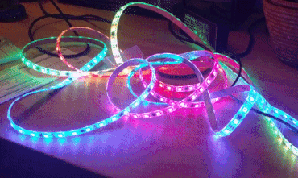

# MQTT RGB Light Strips

A WiFi Connected RGB LED Strip using MQTT. Read the full blog post at
[selfhostedhome.com](https://selfhostedhome.com/wifi-connected-rgb-led-strip/).

## Hardware

Please refer to the blog post for more information. Essentially this is using
[WS2811 LED strips](https://amzn.to/2Cg3rxm) controlled by a [NodeMCU](https://amzn.to/2NI5s7t).

Check out the `schematic/` folder for more information.

## Software

### Embedded

This repository uses [PlatformIO](https://platformio.org/) for building the
embedded software for the NodeMCU. Check out their installation docs for more
information on how to get started with PlatformIO.

The code here supports:
* Control over MQTT topics
* Color Fill
* Different Effects
    * rainbow
    * rainbow\_with\_glitter
    * confetti
    * sinelon
    * bpm
    * juggle
    * candycane
* Over the Air Updates

To get started rename the `src/config_template.h` file to `src/config.h`.
Afterwards update the MQTT topics, WiFi information and LED strip information
to match your setup.

### Home Assistant

Refer to the Home Assistant yaml snippet in the `homeassistant` directory for
how to set up MQTT lights in Home Assistant.
